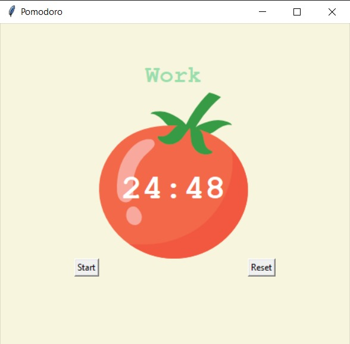

# ⏱️ Pomodoro Timer - Python Project

The **Pomodoro Timer** is a time management tool built with Python and Tkinter based on the Pomodoro Technique. It helps you boost productivity by alternating focused work sessions with short and long breaks. This version includes a dynamic window behavior that positions the timer **at the bottom of the screen during work sessions** and brings it **to the front during breaks**, helping reduce distractions and keeping your workflow optimal.

---

## 🚀 Features

- Clean and interactive **GUI** built with Tkinter.
- Configurable **work**, **short break**, and **long break** durations.
- Automatically cycles through work/break sessions.
- **Visual countdown** timer with a tomato graphic.
- **Session tracker** to display completed pomodoros.
- **Smart window behavior**:
  - Moves to the **bottom** of all windows during work time.
  - Brings itself to the **top/front** during break time.

---

## 📚 Concepts Covered

- GUI design and layout management
- Event-driven programming
- Timer scheduling using `after()`
- Managing application focus dynamically
- Modular function-based code structure

---

## 🖥️ Requirements

- Python 3..13.3
- Tkinter (comes pre-installed with Python)
- `tomato.png` image (used in UI)

## 📷 Preview

---

## 👨‍💻 Author

**Priyanshu Singh**  
GitHub: [priyan17singh](https://github.com/priyan17singh)
